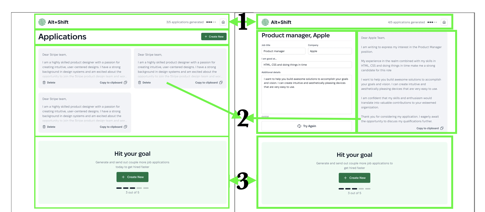

# Variant Frontend Test Task

## Технологический стек

### Frontend: React + TypeScript + Vite
Выбрал Vite, потому что он удобен, быстр, современен и, как запомнил из разговора, используется в проектах Variant.

Выбрал React+TS как требуемый стек по заданию, в виде SPA, а не SSR, так как там один сервис по сути. SEO оптимизации
можно впилить в html-темплейт, в случае очень необходимого сочетания статичного Semantic HTML с динамичными React-компонентами
можно сделать workaround с React.Portal-ами.

### Backend-like: Spin
Требование - хранение данных на фронте + мы обсуждали на собесе идеи по хранению sensitive-данных в браузере.
Spin - продукт от разработчиков [сервиса fermyon](https://fermyon.com/), который позволяет преобразовывать код на различных
языках (включая TS) в WebAssembly (используется в их serverless-функциях), который работает в браузере.
По сути, это бекенд-подобный код, который работает на фронте. Но, главное, он скомпилирован. Собираюсь использовать его для
хранения API-key и вызывать WASM функции, при инициализации которых будет проверяться объект window (window.location.hostname).

Эта базовая защита от вызова кода на других доменах. Можно обойти локально, подредактировав localhost, но это уже оверхед для
халявщиков. В любом случае, чтобы забрать сам ключ, нужно декомпилировать WASM и реверс-инженирить, а если человек готов так
поработать, то взломать можно всё, что угодно.

### Репозиторий и runtime
Монорепо на turbopack (также используется в проектах Variant), так как нужно хочу разделить фронт и бекенд-подобный код,
плюс, возможно в будущем захочется добавить, например, отдельных микрофронтендов / переиспользовать компоненты как
отдельный ui-kit какой-нибудь.

Также бонусом turbopack является наиболее распространённые пресеты TypeScript + ESLint + Prettier, которые я собираюсь использовать.

Компенсация оверхеда монорепозитория - дальнейшие масштабируемость и удобство разработки.

Запускаться проект будет в Bun, потому что он быстр в установке зависимостей, разработке и удобен для монорепозиториев.
Ещё он имеет множество инструментов "из коробки", например, я собираюсь использовать как минимум поддержку WASM и встроенную
среду для unit-тестирования.

## Анализ

### Груминг и декомпозиция

#### Frontend
1. **2 Скрина:**
* Дашборд
* Форма
2. **4 Блока:** 
* Хедер
* Письмо
* Форма
* CTA-Блок
3. **Дерево компонентов**:  
* -- Header - думаю, должен быть частью статичного html, 2 ссылки и  
---- Logo  
---- ApplicationsCounter (ПОРТАЛ)  
---- HomeButton  
* -- TitleRow  
---- Title, h1 "Applications"  
---- *CtaButton*, button "Create new" (ПОРТАЛ)  
* -- ApplicationPreview:  
---- ActionButton: (icon, icon pos, text) "Copy to clipboard", "Delete"  
* Reused components:  
-- CtaButton ("Create new", Form Submit)  
-- ApplicationsCounter (Header, CtaBlock)  
-- Typography/TextSubtitle, h2 (Job title in form, "Hit your goal" in CTA block)  
-- Typography/TextL, p 18/28 (AppCard text, Form)  
-- Typography/TextM, p 18/28 (CtaBlock text, ApplicationsCounter, CtaButton)  
-- Typography/TextS, p 16/24 (Form inputs, ApplicationPreviewButton)  
-- Typography/TextXS, p 14/20 (Form labels, )  
-- Icons 20x20 (copy, delete, refresh form, etc.)  

#### Logic, State
- State: Applications count (on top), Active page (dashboard / form), isFull (5/5 applications)
- Storage: Applications (LocalStorage, caching)
- API-provider for actions: (backend-like, spin)

#### Опциональные улучшения
- Simulate slow API response (form states: borders, button state) - UI/UX
- Application loading animation (+ in ApplicationsList) - UI/UX
- Fingerprints, device detection + analytics (for tracking), GA, Hotjar - Analytics
- Tests coverage (unit, integration, e2e) - Testing

## Структура проекта (на базе анализа)

## Обзор "требования - инструменты"
